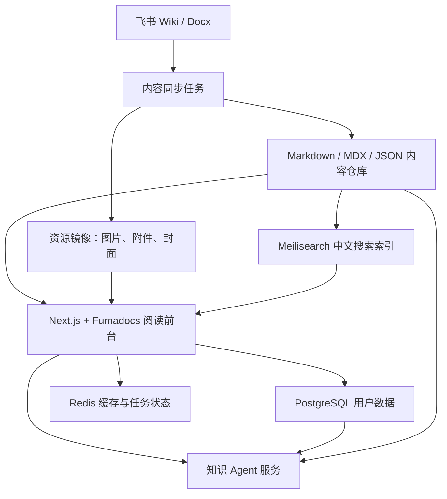

# 飞书课程内容 Web 学习平台方案调研

日期：2026-07-18

本文单独记录“采集 Claude Code 培训文档，保存到飞书，并进一步做成 Web 学习平台”的方案。该方向是一个新产品，不应与 ShengWen 主仓库混合开发。

---

## 1. 背景

本轮已经完成一批 Claude Code 培训文档的采集、飞书写入和排版优化。

原始目标：

- 采集目标站点中的每篇内容。
- 按目标站点目录结构写入飞书 Wiki。
- 修复飞书文档之间的内部链接。
- 统一飞书文档排版风格。
- 去掉公开文档中的原文来源信息。
- 本地保留源站 URL 和飞书 URL 映射，便于维护。

飞书目标空间/目录曾使用：

```text
https://zcnfhebiqluf.feishu.cn/wiki/NCTJwyCXPiATifkzgzMctKZpnYf
```

后续系列文档入口讨论中使用：

```text
https://zcnfhebiqluf.feishu.cn/wiki/VDjuweDqRiAynFk2SjqcSByjnBh
```

本地映射文件：

```text
temp/web-doc-exports/20260715-220654/source-url-map.md
temp/web-doc-exports/20260715-220654/source-url-map.json
```

导出记录：

```text
Generated at: 2026-07-16T00:35:10
```

已验证结果：

- 236 个飞书节点已覆盖写入。
- 包括根节点、39 个目录页、196 个正文页。
- 文档标题统一为“Claude Code 从入门到精通（系列课程版）”方向。
- 公开飞书文档中已移除原文来源信息。
- 内部链接已经尽量映射为飞书 Wiki 链接。
- 本地仍保留源站映射，不在公开课程文档展示。

---

## 2. 产品判断

这件事值得作为新产品独立做。

它不是 ShengWen 的一个功能，而是另一个产品：

```text
ShengWen：负责采集、转录、总结、知识文档生成。
学习平台：负责内容组织、课程阅读、搜索、学习进度和知识 Agent。
```

新产品的核心价值不是“把飞书文档再展示一遍”，而是：

- 把分散内容组织成课程。
- 让中文用户有更好的阅读体验。
- 支持学习路径、进度、收藏、搜索。
- 后续接入知识 Agent，让用户围绕课程内容提问、复习、生成练习。

---

## 3. 推荐技术底座

推荐使用：

```text
Next.js App Router
TypeScript
Tailwind CSS
Fumadocs
PostgreSQL
Redis
Meilisearch
对象存储 OSS/COS
Docker + Nginx
```

### 3.1 为什么是 Next.js

Next.js 适合作为这个中文学习平台的主框架，因为它同时支持：

- 静态内容页。
- SEO。
- 动态用户体系。
- 登录态。
- 学习进度。
- 收藏和笔记。
- 服务端接口。
- 后续接入知识 Agent。

Next.js 官方支持自托管，可以作为 Node.js 服务、Docker 容器或静态导出运行。静态导出也可以部署到任意能托管 HTML/CSS/JS 的 Web 服务器。

参考：

- https://nextjs.org/docs/app/guides/self-hosting
- https://nextjs.org/docs/app/guides/static-exports
- https://nextjs.org/docs/app/getting-started/deploying

### 3.2 为什么是 Fumadocs

Fumadocs 适合作为课程内容阅读层，而不是单纯用 Docusaurus/Nextra。

原因：

- 它是 React 文档框架，适合与 Next.js 结合。
- 支持 MDX、Content Collections、CMS 等内容源。
- 更适合后续做成有产品感的中文学习体验。
- 不会把项目锁死成传统文档站。

参考：

- https://www.fumadocs.dev/
- https://www.fumadocs.dev/docs/manual-installation/next

### 3.3 为什么用 Meilisearch

中文学习平台需要中文搜索能力。MVP 可以先用 Fumadocs 默认搜索，但正式版建议接 Meilisearch。

原因：

- 支持中文、日文、韩文等 CJK 语言。
- 可部署在自己的服务器。
- 搜索索引可以从飞书导出的 Markdown/JSON 构建。
- 后续可以叠加标签、课程、章节、权限过滤。

参考：

- https://meilisearch.com/docs/resources/help/language
- https://meilisearch.com/docs/getting_started/features

### 3.4 为什么参考 feishu-pages

`feishu-pages` 是很接近当前需求的参考项目：它把飞书 Wiki 导出成 Markdown，再交给静态页面生成器。

我们不一定直接使用它，但可以参考：

- 飞书 Wiki 到 Markdown 的同步思路。
- GitHub Actions / CI 定时导出。
- 资源和目录结构处理。
- 文档站生成流程。

参考：

- https://github.com/longbridge/feishu-pages
- https://longbridge.github.io/feishu-pages/

---

## 4. 不推荐的路线

### 4.1 不建议一开始上完整 LMS

LearnHouse 这类完整 LMS 可以作为远期参考，但不适合作为第一阶段底座。

原因：

- 太重。
- 内容同步路径复杂。
- 会迫使产品先适配 LMS 的课程模型，而不是围绕现有飞书内容自然演进。
- 当前核心需求是“中文课程阅读 + 知识组织”，不是完整教学管理系统。

### 4.2 不建议只做纯静态文档站

纯 Docusaurus/VitePress/Nextra 文档站启动快，但会限制后续能力：

- 用户学习进度。
- 收藏。
- 评论。
- 私有课程。
- 付费课程。
- 个性化推荐。
- 知识 Agent。

如果未来明确只做公开文档站，静态站足够；但当前目标已经更接近学习产品。

### 4.3 不建议把学习平台放进 ShengWen

ShengWen 已经承担采集、下载、转录、总结、站点凭据、任务队列等复杂职责。继续放学习平台会让代码边界变混乱。

推荐新建独立项目：

```text
course-learning-platform/
```

或后续确定品牌后使用品牌名。

---

## 5. 面向国内中文用户的部署判断

Next.js 对国内生态是可行的，但不建议以 Vercel 作为中国大陆主部署方案。

原因：

- Vercel 官方说明不提供中国大陆境内托管或监管支持。
- 中国大陆正式服务需要考虑 ICP 备案、国内 CDN、对象存储、网络访问稳定性。
- Next.js 自身可以自托管，真正要避开的主要是默认依赖 Vercel 的部署心智。

参考：

- https://vercel.com/kb/guide/accessing-vercel-hosted-sites-from-mainland-china
- https://www.tencentcloud.com/document/product/583/41593

推荐国内部署形态：

```text
Nginx
  -> Next.js Node 服务 / Docker 容器
  -> PostgreSQL
  -> Redis
  -> Meilisearch
  -> OSS/COS 对象存储
  -> 国内 CDN
```

国内化注意事项：

- 不使用 Google Fonts，字体本地化。
- 图片、附件、视频走国内对象存储和 CDN。
- 搜索使用中文友好的服务。
- 登录优先考虑手机号、微信扫码、飞书/企业微信。
- 支付后续优先微信支付、支付宝。
- 尽早考虑备案、内容合规、版权和用户协议。

---

## 6. 推荐架构



---

## 7. 内容同步方案

建议将飞书作为早期 CMS，但不要让前台直接实时读取飞书。

推荐链路：

```text
飞书 Wiki
  -> 定时同步
  -> 本地或仓库中的 MDX/JSON
  -> 生成目录、slug、frontmatter
  -> 复制图片和附件到对象存储
  -> 构建 Next.js 页面
  -> 建立 Meilisearch 索引
```

这样做的好处：

- 前台性能稳定。
- 不依赖飞书接口实时可用性。
- 可以做版本化和审稿。
- 可以在构建阶段发现断链、空内容、重复标题。
- 可以对公开内容和内部映射做隔离。

建议保留两类文件：

```text
public-content/
  courses/
    claude-code/
      index.mdx
      quickstart/first-task.mdx

internal-maps/
  source-url-map.json
  feishu-node-map.json
```

公开站点只读取 `public-content`，不暴露 `internal-maps`。

---

## 8. 最小可行版本

第一版不做重系统，先做课程阅读产品。

MVP 功能：

- 课程首页。
- 章节目录。
- 正文阅读页。
- 上一篇 / 下一篇。
- 面包屑导航。
- 中文搜索。
- 移动端阅读优化。
- 代码块、提示块、列表、表格样式。
- 飞书同步脚本。
- 断链检查。
- 构建部署。

暂不做：

- 付费。
- 评论。
- 多租户。
- 复杂 LMS 后台。
- AI Agent。
- 复杂推荐系统。

---

## 9. 第二阶段能力

当内容站跑通后，再加用户体系：

- 登录。
- 学习进度。
- 最近阅读。
- 收藏。
- 笔记。
- 学习路径。
- 课程完成状态。

可能的数据表：

```text
users
courses
course_sections
lessons
lesson_progress
bookmarks
notes
search_documents
content_versions
```

---

## 10. 第三阶段：知识 Agent

知识 Agent 不应该一开始就做。它依赖稳定的内容结构和搜索索引。

建议第三阶段再接：

- 课程问答。
- 按章节解释。
- 生成练习题。
- 生成复习卡片。
- 根据用户进度推荐下一步。
- 基于用户笔记做个性化总结。

推荐技术路径：

```text
MDX/JSON 内容
  -> 文本切片
  -> 向量索引 / 全文搜索
  -> RAG 检索
  -> Agent 生成回答
  -> 引用具体课程章节
```

---

## 11. 新项目建议目录

```text
course-learning-platform/
  app/
  components/
  content/
    courses/
  lib/
    content/
    search/
    lark-sync/
  scripts/
    sync-feishu.ts
    build-search-index.ts
    check-links.ts
  prisma/
  public/
  docs/
    product-definition.md
    architecture.md
    content-sync.md
```

---

## 12. 下一步建议

建议新开一个独立 session，并只做新产品初始化：

```text
1. 新建独立项目。
2. 初始化 Next.js + TypeScript + Tailwind。
3. 接入 Fumadocs。
4. 从当前飞书导出结果生成第一批本地 MDX。
5. 做课程首页、目录页、正文页。
6. 接入本地搜索，验证中文搜索体验。
7. Docker 化，预留国内云部署路径。
```

新 session 的建议开场提示词：

```text
请阅读 /Users/subin/Documents/Claude-Project/xian-wen-project/docs/research/feishu-course-web-learning-platform-research.md。
我要新建一个独立的中文学习平台产品，不与 ShengWen 混合。
请先做项目初始化方案和第一版目录结构，技术底座按 Next.js + Fumadocs + TypeScript + Tailwind 处理，后续再接 PostgreSQL、Meilisearch 和飞书同步。
```
